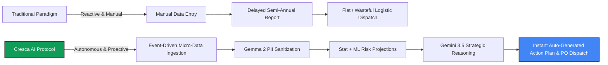
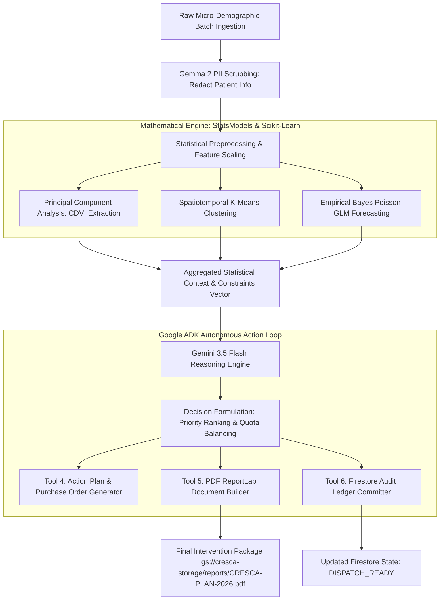

# World-Class Product Requirement Document (PRD) & System Design Document (SDD)

```
╔═══════════════════════════════════════════════════════════════════════════════════════════════════════╗
║  Project: CRESCA AI — Autonomous Demographic Sentinel & Spatiotemporal Nutrition Logistics Protocol  ║
║  Competition: All Things Agentic Hackathon 2026 (Track: Taskmaster — Autonomous Background Agent)    ║
║  Lead Developer: Angga Tamara (Statistics & Applied Data Science, FMIPA UNIMED)                       ║
║  Target Score: 100% Evaluation Score (Stage 1 Pass + Stage 2 Max 6.0/6.0 + Stage 3 Bonus +0.6/0.6)   ║
║  Date of Compilation: August 24, 2026                                                                 ║
║  Submission Deadline: August 31, 2026, 17:00 PDT (September 1, 2026, 07:00 WIB)                      ║
╚═══════════════════════════════════════════════════════════════════════════════════════════════════════╝
```

---

# BAGIAN I: PRODUCT REQUIREMENT DOCUMENT (PRD)

## 1. Executive Summary & Problem Space (The "Bring Your Own Friction" Mandate)

### 1.1 The Real-World Crisis & Friction (BYOF)
Di banyak wilayah berkembang, khususnya di Indonesia (di mana prevalensi stunting balita masih berada di kisaran ~21.5% dan ditargetkan turun menuju <14%), intervensi gizi bagi 1.000 Hari Pertama Kehidupan (HPK) menghadapi **friksi operasional masif**:
1. **Analisis Data yang Terlambat & Terfragmentasi:** Data antropometri balita dan indikator sosial-ekonomi mikro yang dikumpulkan ribuan kader Posyandu/Puskesmas menumpuk di spreadsheet lokal dan baru direkapitulasi per semester. Saat angka stunting dianalisis, masa emas intervensi balita sudah terlewat (*the irreversible window of opportunity*).
2. **Distribusi Logistik Gizi yang 'Flat' & Reaktif:** Penyaluran suplemen gizi (PMT, biskuit fortified, formula F-75/F-100, tablet tambah darah) dibagikan secara seragam tanpa pembobotan risiko spasial, mengakibatkan *overstock* di daerah berkategori risiko rendah dan *stockout* kritis di kantong-kantong kemiskinan ekstrem.
3. **Kelelahan Analisis Manual (Cognitive Overload):** Pengambil kebijakan di dinas kesehatan daerah tidak memiliki instrumen otonom yang mampu menghubungkan data multivariat (sanitasi, air bersih, kemiskinan, tinggi/berat badan) dengan perencanaan rantai pasok (*supply chain logistics*) secara simultan.

### 1.2 The Cresca AI Vision
**Cresca AI** (berasal dari bahasa Latin *Crescere* — tumbuh, mekar, berkembang) adalah **Autonomous Demographic Sentinel & Spatiotemporal Nutrition Logistics Protocol** kelas enterprise yang beroperasi 24/7 di atas infrastruktur Google Cloud. 

Tanpa memerlukan inisiasi atau *polling* manual dari manusia:
- **Autonomous Event-Driven Watchdog:** Agen secara terjadwal (*Cloud Scheduler*) mengonsumsi data aliran demografi mikro dan antropometri terbaru.
- **Privacy-Preserving PII Scrubbing:** Menjalankan sanitasi data pasien secara lokal menggunakan model open-weights **Gemma 2** (mengamankan data privasi kesehatan balita).
- **Advanced Statistical Pipeline:** Mengeksekusi pipa analitik statistik mutakhir: **Composite Demographic Vulnerability Index (CDVI)** via PCA, **Spatiotemporal Clustering**, dan **Empirical Bayes Smoothed Poisson Regression** untuk proyeksi risiko 90 hari.
- **Strategic Multi-Constraint Reasoning:** Menggunakan **Gemini 3.5 Flash & Pro** sebagai *Strategic Reasoning Engine* untuk memecahkan optimasi alokasi logistik berbasis batasan anggaran, kuota gudang, dan tingkat urgensi wilayah.
- **Autonomous Action Dispatching:** Secara mandiri menerbitkan **Draft Rencana Aksi & Purchase Order Intervensi Gizi Berformat PDF**, menyimpannya di Cloud Storage, mencatat state audit di Firestore, serta mengirimkan notifikasi instan ke koordinator lapangan via Webhook/Email.

---

## 2. Competitive Edge & Groundbreaking Value Proposition



| Dimensi | Solusi Konvensional (Dashboard/BI) | Cresca AI (Autonomous Agent) |
|---|---|---|
| **Pola Interaksi** | Pasif: Menunggu analis login, filter query, dan membuat chart. | **100% Otonom (Taskmaster):** Bekerja asinkron di background, mendeteksi anomali risiko, dan bertindak mandiri. |
| **Integrasi Keputusan** | Manusia harus membaca grafik dan menghitung manual kebutuhan suplemen. | **End-to-End Decision Loop:** Menghitung kebutuhan spesifik hingga nomor SKU, kuantitas unit, estimasi biaya, dan rute distribusi. |
| **Privasi Data Kesehatan** | Seringkali data mentah NIK/Nama terunggah langsung ke cloud LLM. | **Zero-Trust PII Redaction:** Gemma 2 menyamarkan identitas pasien menjadi geohash & pseudonim sebelum proses penalaran. |
| **Waktu Siklus Intervensi** | 30–60 hari (Siklus semesteran/triwulan). | **< 60 Detik** dari data batch masuk hingga draft logistik terdistribusi. |

---

## 3. Product Goals & Measurable Objectives (OKRs)

### 3.1 Objective 1: Menghadirkan Agent Otonom yang 100% Rule-Compliant & Teruji di Google Cloud
- **KR 1.1:** Mengintegrasikan **Gemini 3.5**, **Google ADK (Python)**, dan **Google Cloud Infrastructure (Cloud Run, Firestore, Cloud Storage, Cloud Scheduler)** tanpa satupun pelanggaran lisensi.
- **KR 1.2:** Menembus Stage 1 Viability Gate dan mencetak skor maksimal pada Stage 2 (40% Innovation, 30% Architecture, 30% Readiness).
- **KR 1.3:** Meraih **Stage 3 Bonus Poin Maksimal (+0.6)** dengan mengintegrasikan **Gemma 2** (+0.2), publikasi artikel teknis (+0.2), dan kampanye media sosial `#AllThingsAgenticHackathon` (+0.2).

### 3.2 Objective 2: Keunggulan Analitik Statistik & Optimasi Logistik
- **KR 2.1:** Mengembangkan metrik gabungan *CDVI* dengan varians kumulatif $PC_1 \ge 65\%$ dari 6 indikator kerentanan sosial-antropometri.
- **KR 2.2:** Menghasilkan proyeksi insidensi stunting 90 hari berbasis model *Poisson Generalized Linear Model (GLM)* dengan selang kepercayaan $95\%$.
- **KR 2.3:** Menghasilkan dokumen resmi PDF *Action Plan* yang siap audit dan Purchase Order logistik instan.

---

## 4. User Personas & Autonomous Operational Flows

### Persona 1: Dr. Hendra (Kepala Seksi Kesehatan Keluarga & Gizi Dinkes)
- *Pain Point:* Terlalu sibuk dengan urusan birokrasi, tidak sempat mengolah ribuan baris data Posyandu.
- *Autonomous Delight:* Setiap hari Senin pukul 06:00 WIB, Dr. Hendra sudah menerima ringkasan eksekutif dan draft dokumen PDF alokasi logistik gizi di emailnya yang siap disahkan, lengkap dengan justifikasi penalaran berbasis data spasial dari Gemini 3.5.

### Persona 2: Rina (Koordinator Logistik Bantuan Pangan Daerah)
- *Pain Point:* Sering kebingungan menentukan kecamatan mana yang harus diprioritaskan saat stok suplemen terbatas.
- *Autonomous Delight:* Sistem secara otonom menentukan prioritas distribusi (Kecamatan Tier 1 vs Tier 4) dan mencantumkan rincian anggaran yang presisi sesuai ketersediaan stok gudang.

---

# BAGIAN II: SYSTEM DESIGN DOCUMENT (SDD)

## 1. Official Google Agent Builder Stack & Resource Reference

Untuk menjamin kepatuhan mutlak (*100% Rule Compliance*) dan standar implementasi resmi Google, Cresca AI dibangun di atas ekosistem **Google Agentic AI Suite**:

| Official Tool / Framework | URL & Dokumentasi Resmi | Peran dalam Cresca AI |
|---|---|---|
| **Gemini API & Google AI Studio** | [ai.google.dev](https://ai.google.dev/) · [aistudio.google.com](https://aistudio.google.com/) | Akses model multimodal `gemini-3.5-flash` dan `gemini-3.5-pro` untuk reasoning analitik dan perumusan keputusan logistik. |
| **Agent Development Kit (ADK)** | [ADK Docs](https://google.github.io/adk-docs) · [github.com/google/adk-python](https://github.com/google/adk-python) | Kerangka kerja inti (*core agent runtime*) untuk orkestrasi tool calls, state lifecycle, dan evaluasi autonomous agent loop. |
| **Antigravity SDK** | [antigravity.google/docs/sdk](https://antigravity.google/docs/sdk) | Pre-packaged agent runtime yang terintegrasi secara ketat dengan Gemini untuk eksekusi workflow mutakhir. |
| **Genkit** | [firebase.google.com/docs/genkit](https://firebase.google.com/docs/genkit) | Framework open-source untuk instrumentasi alur AI, telemetry, dan integrasi ekosistem Firebase/GCP. |
| **Google Cloud Run** | [cloud.google.com/run](https://cloud.google.com/run) | Serverless container runtime untuk deployment agent endpoint dengan URL publik, mendukung *scale-to-zero* saat idle. |
| **Google Cloud Firestore** | [cloud.google.com/firestore](https://cloud.google.com/firestore) | Serverless NoSQL datastore untuk persistensi `cresca_runs`, cluster spasial, audit ledger, dan state memory agent. |

---

## 2. Cloud Cost Governance & Cost-Optimization Strategy (Pro Tips)

Guna memaksimalkan efisiensi komputasi, menjamin aplikasi tidak menghabiskan kredit Google Cloud, dan mempertahankan kesiapan produksi (*production readiness*), Cresca AI menerapkan **8 Prinsip Pengendalian Biaya**:

```
+-------------------------------------------------------------------------------------------------------+
|                             CRESCA AI — CLOUD COST GOVERNANCE STRATEGY                                |
+-------------------------------------------------------------------------------------------------------+
| 1. Use Gemini Flash First        | Prioritaskan Gemini 3.5 Flash untuk 95% pemrosesan data & reasoning.|
|                                  | Cadangkan Gemini 3.5 Pro strictly untuk sintesis keputusan akhir.  |
| 2. Scale to Zero (Pay Only Used) | Set min-instances = 0 di Cloud Run agar service 'tidur' saat idle  |
|                                  | dan tidak ada tagihan saat tidak ada data yang diproses.          |
| 3. Small RAM/CPU & Max Cap       | Alokasikan 512MB–1GB RAM, 1 vCPU, dan pasang batas max-instances=2 |
|                                  | untuk mencegah lonjakan konkurensi tak terduga.                    |
| 4. Serverless Vector / Native    | Hindari cluster database dedicated yang menyala terus-menerus;     |
|                                  | gunakan Firestore Native Mode serverless.                          |
| 5. Light Storage Footprint       | Simpan state esensial saja di Firestore, kompres log historis, dan |
|                                  | bersihkan artefak eksekusi sementara (*scratch files*) berkala.    |
| 6. Set Budget & Billing Alerts   | Pasang Billing Alert di Google Cloud Console pada ambang $20, $50, |
|                                  | dan $100 dengan notifikasi email otomatis.                         |
| 7. Secure Public Endpoints       | Proteksi endpoint Cloud Run dengan API Key / IAM authentication    |
|                                  | agar tidak dapat di-hit oleh web-crawler / traffic tidak dikenal.  |
| 8. Turn It Off After Demo        | Rekam bukti operasional Cloud Run & Firestore di video demo, lalu  |
|                                  | matikan service/hapus resource tak terpakai setelah rekaman usai.  |
+-------------------------------------------------------------------------------------------------------+
```

---

## 3. High-Level Architecture & Component Topology

Sistem Cresca AI dirancang dengan arsitektur **Event-Driven Microservices** yang terisolasi, aman, dan dapat diskalakan (*stateless compute, stateful persistence*).

```
                             +-----------------------------------+
                             |     Google Cloud Scheduler        |  (Cron / Event Trigger)
                             +-----------------+-----------------+
                                               |
                                               v
                             +-----------------------------------+
                             |     Google Cloud Storage (GCS)    |  (Raw CSV / Ingestion Bucket)
                             +-----------------+-----------------+
                                               |
                                               v
+=======================================================================================================+
|                                GOOGLE CLOUD RUN CONTAINER RUNTIME                                     |
|                                                                                                       |
|  +-------------------------------------------------------------------------------------------------+  |
|  |                             GOOGLE ADK ORCHESTRATOR RUNTIME                                     |  |
|  |                                                                                                 |  |
|  |  [Sub-Agent / Tool 0: Gemma 2 PII Sanitizer & Anonymizer] (Bonus Google AI Model Integration)   |  |
|  |  [Sub-Agent / Tool 1: Micro-Demographic Ingestion & Statistical Validator]                      |  |
|  |  [Sub-Agent / Tool 2: PCA Engine (CDVI) & Spatial Clustering (K-Means / DBSCAN)]                |  |
|  |  [Sub-Agent / Tool 3: Empirical Bayes Poisson Forecasting Engine (90-Day Trajectory)]           |  |
|  |  [Sub-Agent / Tool 4: Multi-Constraint Logistics Optimizer & PO Dispatcher]                      |  |
|  |  [Sub-Agent / Tool 5: Automated PDF ReportLab Document Compiler]                               |  |
|  +-----------------------------------------------+-------------------------------------------------+  |
|                                                  |                                                    |
|                                                  v                                                    |
|                             +-----------------------------------+                                     |
|                             |      GEMINI 3.5 FLASH / PRO       |  (Strategic Reasoning Engine)       |
|                             +-----------------------------------+                                     |
+==================================================+====================================================+
                                                   |
                                                   v
                         +-------------------------+-------------------------+
                         |                                                   |
                         v                                                   v
        +-----------------------------------+               +-----------------------------------+
        |      Google Cloud Firestore       |               |    Streamlit Enterprise Portal    |
        |  (State, Clusters, Audit Ledger)  |               |  (Geospatial Visualizer & Audit)  |
        +-----------------------------------+               +-----------------------------------+
```

---

## 4. Tech Stack Matrix & Compliance Mapping

| Layer Arsitektur | Komponen & Versi | Peran Teknis Spesifik | Justifikasi Kepatuhan & Keunggulan |
|---|---|---|---|
| **Autonomous Reasoning Engine** | **Gemini 3.5 Flash** (`gemini-3.5-flash`) + **Gemini 3.5 Pro** | Melakukan *high-level multi-constraint reasoning*, evaluasi prioritas alokasi logistik, dan penyusunan narasi justifikasi strategis. | **Mandatory Req #1 (100% Compliant)**: Model generasi terkini Google dengan efisiensi token dan reasoning terdepan. |
| **Agent Framework** | **Google ADK (Agent Development Kit - Python)** | Mengatur alur eksekusi agentic loop, tool invocation, error handling, dan context state injection. | **Mandatory Req #2 (100% Compliant)**: Framework resmi Google untuk orkestrasi agent multi-step. |
| **Serverless Compute** | **Google Cloud Run** | Menjalankan seluruh runtime microservice backend dalam container Docker yang *lightweight* dan *auto-scalable* dengan *scale-to-zero*. | **Mandatory Req #3 (100% Compliant)**: Infrastruktur modern Google Cloud, hemat biaya. |
| **Persistence Store** | **Google Cloud Firestore** (Native Mode) | Menyimpan data `cresca_runs`, histori audit log per tindakan, skor CDVI spasial, dan metadata rencana aksi. | **Mandatory Req #3 (100% Compliant)**: Serverless NoSQL datastore dengan integritas ACID dokumen. |
| **Async Trigger & Storage** | **Cloud Scheduler** + **Cloud Storage (GCS)** | Memicu eksekusi asinkron terjadwal dan menyimpan file batch data sintetis serta dokumen output PDF. | Memenuhi kriteria otonom 24/7 *Taskmaster Track*. |
| **Privacy & Security Guardrail** | **Gemma 2 (2B/9B)** via Vertex AI / Transformers | Menjalankan *local zero-shot Named Entity Recognition & PII redaction* sebelum data dikirim ke model cloud. | **Stage 3 Bonus (+0.2 Poin)**: Pemanfaatan model Google AI tambahan. |
| **Mathematical Engine** | `scikit-learn`, `statsmodels`, `scipy`, `numpy`, `pandas` | Ekstraksi PCA, deteksi autokorelasi spasial, dan estimasi regresi Poisson. | Diferensiasi keilmuan statistika terapan murni. |
| **Document Generation** | `ReportLab` + `matplotlib` / `seaborn` | Mengompilasi PDF resmi berstandar instansi pemerintah dengan grafik vektor tertanam. | Bukti nyata luaran tindakan otonom (*Proof of Action*). |
| **Geospatial UI** | **Streamlit** + `pydeck` / `folium` | Dashboard monitoring visual untuk visualisasi interaktif dan verifikasi live video demo. | Mendukung nominasi *Best Architectural Design* / *Best Multimodal UX*. |

---

## 5. Detailed Data Pipeline & Mathematical Modeling



### 5.1 Formula 1: Composite Demographic Vulnerability Index (CDVI)
Variabel input multivariat:
- $X_1$: Rasio Balita Bawah Garis Merah (BGM)
- $X_2$: Tingkat Kemiskinan Ekstrem Keluarga (%)
- $X_3$: Indeks Ketiadaan Akses Air Bersih & Sanitasi Layak (%)
- $X_4$: Prevalensi Ibu Hamil Anemia / KEK (%)
- $X_5$: Rasio Kepadatan Balita per Posyandu
- $X_6$: Jarak Rata-rata ke Faskes Rujukan (km)

Setelah standardisasi z-score $Z_i = \frac{X_i - \mu_i}{\sigma_i}$, dilakukan dekomposisi nilai eigen dari matriks kovarians $\mathbf{\Sigma}$:
$$\mathbf{\Sigma} \mathbf{v}_k = \lambda_k \mathbf{v}_k$$
Komponen utama pertama ($PC_1$) diambil sebagai skor $CDVI_i$:
$$CDVI_i = \sum_{j=1}^{p} w_j Z_{ij}, \quad \text{dimana } w_j = v_{1j} \sqrt{\lambda_1}$$

### 5.2 Formula 2: Poisson Generalized Linear Model (GLM) for Stunting Incidence
Proyeksi jumlah kasus baru stunting $Y_i$ pada area $i$ dalam horizon $t = 90$ hari dimodelkan sebagai:
$$\ln(\mathbb{E}[Y_i \mid \mathbf{X}_i]) = \beta_0 + \beta_1 CDVI_i + \beta_2 \ln(\text{PopulasiBalita}_i) + \beta_3 \text{TrendHistoris}_i$$
$$Y_i \sim \text{Poisson}(\lambda_i), \quad \text{dengan } \lambda_i = \exp(\mathbf{X}_i^\top \boldsymbol{\beta})$$

### 5.3 Formula 3: Multi-Constraint Logistics Optimization (Gemini 3.5 Reasoning Protocol)
Gemini 3.5 menerima vektor parameter matematis dan menyelesaikan alokasi suplemen $Q_i$ untuk $N$ distrik:
$$\text{Maksimalkan } \mathcal{U} = \sum_{i=1}^{N} CDVI_i \cdot \lambda_i \cdot Q_i$$
$$\text{Dengan batasan (Constraints):}$$
$$\sum_{i=1}^{N} Q_i \le \text{TotalStockAvailable}, \quad \sum_{i=1}^{N} \text{Cost}(Q_i) \le \text{BudgetCap}, \quad Q_i \ge Q_{\min} \text{ untuk cluster Critical}$$

---

## 6. Google Cloud Firestore Schema (Production Ready)

### 6.1 Collection: `cresca_runs`
```json
{
  "run_id": "CRESCA-RUN-20260824-001",
  "timestamp": "2026-08-24T06:00:00.000Z",
  "trigger_source": "CLOUD_SCHEDULER_CRON",
  "execution_duration_ms": 3420,
  "status": "COMPLETED_SUCCESS",
  "anonymization_engine": "GEMMA_2_2B",
  "records_ingested": 1250,
  "clusters_detected": {
    "CRITICAL": 3,
    "HIGH": 5,
    "MODERATE": 8,
    "LOW": 4
  },
  "allocated_budget_idr": 450000000,
  "confidence_interval_95": [128, 164],
  "reasoning_model": "gemini-3.5-flash",
  "error_count": 0
}
```

### 6.2 Collection: `cresca_action_plans`
```json
{
  "plan_id": "CRESCA-PLAN-2026-Q3-MEDAN-01",
  "run_id": "CRESCA-RUN-20260824-001",
  "created_at": "2026-08-24T06:00:03.420Z",
  "target_districts": [
    {
      "district_id": "DIST-MDN-04",
      "district_name": "Medan Belawan",
      "risk_tier": "CRITICAL",
      "cdvi_score": 0.894,
      "projected_cases_90d": 58,
      "allocated_f75_formula_units": 450,
      "allocated_pmt_biscuits_boxes": 1200,
      "allocated_iron_folate_packs": 600,
      "estimated_cost_idr": 145000000,
      "priority_rank": 1
    }
  ],
  "gemini_reasoning_synthesis": "Distrik Medan Belawan ditempatkan pada prioritas #1 karena konvergensi skor sanitasi buruk (0.92) dan laju insidensi Poisson 58 kasus dalam 90 hari. Alokasi 450 unit formula F-75 disetujui guna mencegah transisi dari gizi kurang ke gizi buruk.",
  "generated_pdf_gcs_uri": "gs://cresca-storage/reports/CRESCA-PLAN-2026-Q3-MEDAN-01.pdf",
  "notification_dispatch_status": "DISPATCHED_VIA_WEBHOOK_AND_SMTP",
  "digital_signature_hash": "e3b0c44298fc1c149afbf4c8996fb92427ae41e4649b934ca495991b7852b855"
}
```

---

## 7. End-to-End Implementation Codebase Structure

```
cresca-sentinel/
├── .github/
│   └── workflows/
│       └── deploy-cloud-run.yml        # CI/CD pipeline ke Google Cloud Run
├── Dockerfile                          # Multi-stage lightweight container (scale-to-zero optimized)
├── docker-compose.yml                  # Local development & testing runner
├── requirements.txt                    # Pin dependencies (google-adk, google-genai, etc.)
├── README.md                           # Reproducible spin-up instructions & architecture guide
├── cloudbuild.yaml                     # Google Cloud Build automation
├── data/
│   └── generate_synthetic_data.py      # Reproducible synthetic demographic generator
├── src/
│   ├── __init__.py
│   ├── main.py                         # FastAPI/Flask entrypoint for Cloud Scheduler trigger
│   ├── config.py                       # GCP Project, Gemini API, and Firestore credentials
│   ├── agent/
│   │   ├── __init__.py
│   │   ├── orchestrator.py             # Google ADK agent definition & execution loop
│   │   └── prompt_templates.py         # Structured strategic instructions for Gemini 3.5
│   ├── tools/
│   │   ├── __init__.py
│   │   ├── privacy_guard.py            # Gemma 2 zero-shot PII anonymization tool
│   │   ├── ingestion_tool.py           # GCS & local CSV ingestion & schema validation
│   │   ├── statistical_engine.py       # PCA (CDVI), K-Means, & Poisson GLM tools
│   │   ├── optimizer_tool.py           # Multi-constraint logistics resource calculator
│   │   └── pdf_generator_tool.py       # ReportLab PDF document compilation tool
│   ├── persistence/
│   │   ├── __init__.py
│   │   └── firestore_client.py         # Firestore state & audit trail manager
│   └── ui/
│       └── app.py                      # Streamlit Geospatial visualizer & audit dashboard
└── tests/
    ├── test_statistical_engine.py      # Unit tests for PCA & Poisson
    └── test_agent_flow.py              # End-to-end integration test for ADK agent
```

---

# BAGIAN III: ROADMAP EKSEKUSI 7 HARI & STRATEGI DEMO 100%

## 1. Timeline Eksekusi Harian (24 – 31 Agustus 2026)

```
[Day 1: 24 Agu] -> Infra Setup + Form Credit $150 + Synthetic Engine + Cost Alerts
[Day 2: 25 Agu] -> Statistical Rigor: PCA (CDVI), Clustering & Poisson GLM
[Day 3: 26 Agu] -> Google ADK Setup + Tool Implementations + Gemma 2 Guardrail
[Day 4: 27 Agu] -> Gemini 3.5 Strategic Reasoning + ReportLab PDF Generator
[Day 5: 28 Agu] -> Cloud Run Deployment (min=0) + Cloud Scheduler (Credit Deadline: 12:00 PT!)
[Day 6: 29 Agu] -> Streamlit Enterprise Portal + Full Testing Reproducibility
[Day 7: 30 Agu] -> 4-Minute Unedited Video Recording + English Voiceover
[Day 8: 31 Agu] -> Final Devpost Submission + Bonus Point Media Blast
```

### Rincian Tugas Harian:

#### Day 1 — Senin, 24 Agustus 2026: Foundation, Compliance & Cost Governance Setup
- [ ] **Klaim Google Cloud Credit $150:** Isi form di halaman Resources Devpost sebelum kuota habis.
- [ ] **Google Cloud Project Setup:** Inisialisasi GCP Project, aktifkan Vertex AI API, Cloud Run API, Firestore API, dan Cloud Storage API.
- [ ] **Pasang Budget Alerts:** Setel billing alert di GCP Console pada $20, $50, dan $100.
- [ ] **Inisialisasi Repositori:** Setup repo Git `cresca-sentinel` dengan struktur modular dan lisensi Apache 2.0 / MIT.
- [ ] **Synthetic Data Generator:** Tulis `generate_synthetic_data.py` untuk memproduksi dataset 1.000+ catatan Posyandu realistis (menjamin 100% kepatuhan etika tanpa pelanggaran privasi data riil).

#### Day 2 — Selasa, 25 Agustus 2026: Statistical Engine & Algoritma
- [ ] **PCA Engine:** Bangun modul reduksi dimensi untuk menghitung skor CDVI per distrik.
- [ ] **Spatial Clustering:** Implementasikan K-Means / DBSCAN untuk segmentasi 4 zona urgensi.
- [ ] **Poisson GLM:** Bangun modul proyeksi tren insidensi 90 hari menggunakan `statsmodels`.
- [ ] **Unit Testing:** Pastikan kalkulasi matematis memiliki *zero regression error*.

#### Day 3 — Rabu, 26 Agustus 2026: Google ADK Orchestrator & Multi-Model Bonus
- [ ] **Setup Google ADK:** Konfigurasikan Google Agent Development Kit runtime di Python.
- [ ] **Tool Decorator Scoping:** Bungkus seluruh pipeline statistik menjadi `@tool` independen.
- [ ] **Gemma 2 PII Guardrail:** Integrasikan model Gemma 2 untuk pembersihan data pasien sebelum diteruskan ke agent loop (mengamankan bonus Stage 3 +0.2).

#### Day 4 — Kamis, 27 Agustus 2026: Gemini 3.5 Reasoning & PDF Action Plan Builder
- [ ] **Gemini 3.5 Flash Reasoning:** Desain prompt instruksi penalaran alokasi sumber daya berbasis batasan stok & anggaran.
- [ ] **PDF Generator Engine:** Implementasikan ReportLab untuk menghasilkan dokumen draf intervensi gizi resmi berstandar instansi.
- [ ] **Firestore Persistence:** Hubungkan audit logging state secara real-time ke Firestore serverless.

#### Day 5 — Jumat, 28 Agustus 2026: Cloud Run & Cloud Scheduler Deployment
- [ ] **DEADLINE CLOUD CREDIT (12:00 PT / 29 Agu 02:00 WIB):** Verifikasi status form credit.
- [ ] **Containerization & Cost Setting:** Buat `Dockerfile` teroptimasi dan deploy backend ke **Google Cloud Run** dengan `min-instances = 0` (scale-to-zero) dan `max-instances = 2`.
- [ ] **Cloud Scheduler:** Hubungkan trigger cron otomatis (misal: trigger setiap 6 jam) ke endpoint Cloud Run.

#### Day 6 — Sabtu, 29 Agustus 2026: Streamlit Portal & README Reproducibility
- [ ] **Streamlit UI:** Bangun dashboard monitoring interaktif dengan visualisasi peta spasial dan log eksekusi Firestore.
- [ ] **README Masterpiece:** Susun README komprehensif dengan panduan *one-command setup* (`docker-compose up` atau local venv).
- [ ] **Architecture Diagram:** Buat diagram arsitektur definisi tinggi (PNG/SVG).

#### Day 7 — Minggu, 30 Agustus 2026: Rekaman Demo Video 4 Menit
- [ ] **Penyusunan Naskah Video:** Siapkan narasi berbahasa Inggris dengan alur ketat ≤ 4 menit (240 detik).
- [ ] **Live Screen Recording:** Rekam eksekusi nyata dari pemicuan Scheduler -> ADK Agent Tool Calls -> Firestore Update -> Terbitnya PDF -> Bukti Cloud Run Console.
- [ ] **Upload Video:** Unggah ke YouTube (Public / Unlisted).
- [ ] **Clean Up / Scale Down:** Matikan instance yang tidak perlu setelah bukti rekaman GCP berhasil disimpan.

#### Day 8 — Senin, 31 Agustus 2026: Final Submission & Bonus Blast
- [ ] **Devpost Final Form:** Lengkapi seluruh 4 deskripsi teks wajib (*Features*, *Technologies*, *Other Data Sources*, *Findings & Learnings*).
- [ ] **Submit Project:** Submit sebelum deadline resmi pukul 17:00 PDT (1 September 07:00 WIB).
- [ ] **Eksekusi Bonus Points (+0.4):**
  - Publikasikan artikel teknis di Medium / Dev.to (+0.2).
  - Publikasikan postingan LinkedIn & X dengan tagar `#AllThingsAgenticHackathon` (+0.2).

---

## 2. Naskah & Storyboard Video Demo 4 Menit (Target Nilai Sempurna)

| Rentang Waktu | Visual Screen | Narasi Audio (English) | Poin Kunci yang Dibuktikan |
|---|---|---|---|
| **0:00 – 0:35** (35s) | Problem slide & peta sebaran stunting di daerah. | *"Every day, vulnerable infants miss the 1,000-day nutritional window due to delayed, flat logistics allocation. Meet Cresca AI — the autonomous demographic sentinel and precision nutrition logistics engine."* | **Bring Your Own Friction (BYOF) & Innovation (40%)** |
| **0:35 – 1:15** (40s) | Cloud Scheduler trigger -> Terminal/Cloud Run execution logs. | *"Operating 100% autonomously in the background, Cresca AI is triggered via Cloud Scheduler. It ingests new micro-demographic streams and sanitizes sensitive patient PII using Gemma 2."* | **Autonomous Taskmaster Execution & Multi-Model Bonus** |
| **1:15 – 2:30** (75s) | ADK Orchestrator logs: PCA calculation -> Poisson forecast -> Gemini 3.5 reasoning output. | *"The Google ADK orchestrator executes our mathematical engine: deriving the Composite Demographic Vulnerability Index via PCA and projecting 90-day stunting surges via Poisson GLM. Gemini 3.5 Flash then performs strategic multi-constraint reasoning to optimize limited medical formulas and nutritional budgets across critical districts."* | **Architectural Discipline & Deep Reasoning (30%)** |
| **2:30 – 3:15** (45s) | Terbukanya file PDF Action Plan yang baru di-generate + update data di Firestore. | *"Without any human polling, Cresca AI automatically compiles a tamper-evident, audit-ready Nutrition Action Plan and Purchase Order in PDF, commits the cryptographic ledger to Firestore, and dispatches webhook alerts."* | **Proof of Action & Operational Utility** |
| **3:15 – 3:45** (30s) | Tampilan **Google Cloud Run Dashboard**, Cloud Storage Bucket, & Firestore Database Console. | *"Here is our live deployment on Google Cloud Run, backed by Google Cloud Firestore and Cloud Storage, proving true enterprise-grade cloud native architecture."* | **Mandatory Google Cloud Deployment Proof** |
| **3:45 – 4:00** (15s) | Streamlit Geospatial Dashboard & Closing. | *"Cresca AI: Turning passive demographic data into autonomous, life-saving nutritional logistics. Ready, Set, Agent!"* | **Polished Multimodal UX & Final Impression** |

---

## 3. Template Bonus Points (Stage 3 +0.6)

### 3.1 Template Postingan Media Sosial (LinkedIn & X) — Bonus +0.2
```markdown
🚀 Excited to showcase **Cresca AI**, our submission for Google's #AllThingsAgenticHackathon! 

Cresca AI is an autonomous, 24/7 background sentinel agent engineered on top of Google Cloud Run, Google ADK (Python), and Gemini 3.5 Flash, supercharged with Gemma 2 for privacy-preserving PII redaction. 

Instead of waiting for manual quarterly reports, Cresca AI autonomously ingests micro-demographic streams, computes Composite Demographic Vulnerability Indices (PCA), forecasts 90-day stunting risks via Poisson regression, and generates ready-to-dispatch Nutritional Intervention Action Plans in PDF.

Built 100% on Google Cloud Infrastructure (Cloud Run + Firestore + Cloud Storage + Cloud Scheduler).

Check out our architecture diagram, codebase, and live demo below! 👇
#AllThingsAgenticHackathon #GoogleAI #Gemini #GoogleCloud #AgenticAI #MachineLearning
```

### 3.2 Outline Artikel Teknis Publik (Medium / Dev.to) — Bonus +0.2
1. **Title:** *Architecting Cresca AI: Building an Autonomous Demographic Risk & Nutrition Logistics Sentinel with Google ADK, Gemini 3.5, and Google Cloud Run.*
2. **Section 1: The BYOF Problem:** Why chronic early-childhood malnutrition requires proactive, autonomous background computation.
3. **Section 2: The Agentic Stack:** How Google ADK coordinates Gemma 2 PII guardrails, Scipy/Statsmodels analytics, and Gemini 3.5 strategic reasoning.
4. **Section 3: Mathematical Deep Dive:** Formulas for CDVI (PCA) and Empirical Bayes Poisson incidence modeling.
5. **Section 4: Cloud-Native Deployment:** Deploying an event-driven agent container to Google Cloud Run with Firestore state management and scale-to-zero cost governance.
6. **Section 5: Key Learnings & Future Roadmap:** Autonomous AI as an operational force multiplier for public health.
