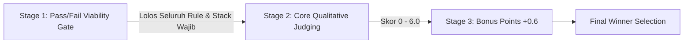

# Panduan Teknis Komprehensif & Compliance Master Guide
## All Things Agentic Hackathon 2026

> **Peserta:** Angga Tamara (Statistics, FMIPA UNIMED)  
> **Kompetisi:** All Things Agentic Hackathon (Sponsored by Google, Administered by Devpost)  
> **Official Portal:** [Overview](https://allthingsagentichackathon.devpost.com/) · [Official Rules](https://allthingsagentichackathon.devpost.com/rules) · [Resources](https://allthingsagentichackathon.devpost.com/resources)

---

## 1. Ringkasan Kompetisi & Jadwal Kritis

| Parameter | Detail Resmi & Konversi Waktu |
|---|---|
| **Tema Utama** | *"Ready, Set, Agent!"* — Membangun agent AI otonom yang bekerja *async in the background*, menangani *heavy lifting* komputasi/data besar, dan mengotomasi *multi-step workflow* tanpa intervensi manual berulang. |
| **Contest Period** | 3 Agustus 2026, 09:00 PT – 31 Agustus 2026, 17:00 PT |
| **Deadline Submission** | **31 Agustus 2026, 17:00 PDT** (Selasa, 1 September 2026, 07:00 WIB) |
| **Google Cloud $150 Credit Form Deadline** | **28 Agustus 2026, 12:00 PT** (Sabtu, 29 Agustus 2026, 02:00 WIB) — *Klaim secepatnya via form di halaman Resources, kuota terbatas & review butuh s.d. 72 jam.* |
| **Judging Period** | 1 September – 1 Oktober 2026 |
| **Pengumuman Pemenang** | ± 8 Oktober 2026 |
| **Total Hadiah** | **$180.000** (Grand Prize: $50.000 + $5k GCP Credit; Track Winner: $20.000; Individual/Hobbyist: $10.000; Best Architecture: $5.000; Best Multimodal UX: $5.000) |
| **Eligibility** | Indonesia **Eligible** (bukan negara yang terkena sanksi OFAC / embargo). Usia dewasa hukum, memiliki koneksi internet, dan karya bersifat orisinal baru. |

---

## 2. Compliance Matrix — 100% Mandatory Technical Stack

Setiap submission **WAJIB** memenuhi 3 pilar teknologi Google berikut agar lolos Stage 1 (Pass/Fail Viability Gate):

```
+-------------------------------------------------------------------------+
|                  MANDATORY GOOGLE TECHNOLOGY TRIFECTA                   |
+------------------------------------+------------------------------------+
| 1. FOUNDATION MODEL                | 2. AGENT ORCHESTRATION FRAMEWORK   |
|    Gemini 3.5+ (Flash / Pro) via   |    Google ADK (Agent Development   |
|    Gemini API / Vertex AI SDK      |    Kit - Python) / Google GenAI SDK|
+------------------------------------+------------------------------------+
| 3. GOOGLE CLOUD INFRASTRUCTURE                                          |
|    Google Cloud Run (Serverless Compute Execution)                      |
|    Google Cloud Firestore (Agent State & Execution Persistence)         |
|    Google Cloud Storage / Cloud Scheduler / Pub/Sub (Async Triggers)    |
+-------------------------------------------------------------------------+
```

### Rincian Kepatuhan Teknis:

| # | Komponen Wajib | Implementasi & Verifikasi |
|---|---|---|
| **1** | **Gemini 3.5 atau Lebih Baru** | Gunakan `google-genai` SDK atau `@google/genai` dengan model target `gemini-3.5-flash` atau `gemini-3.5-pro` untuk reasoning tingkat tinggi, perencanaan tindakan, dan sintesis keputusan strategis. |
| **2** | **Google Agent Framework** | Gunakan **Google ADK (Python)** untuk orkestrasi multi-agent/multi-tool, tool invocation decorator (`@tool`), session state, dan loop reasoning-action yang terstruktur. |
| **3** | **Google Cloud Infrastructure** | Backend dideploy di **Google Cloud Run**, data & state persistensi di **Google Cloud Firestore**, dan trigger asinkron dijalankan via **Google Cloud Scheduler** / **Pub/Sub**. |

---

## 3. Official Google Agent Builder Suite & Resource References

| Resource Suite | URL Resmi | Panduan Penggunaan |
|---|---|---|
| **Gemini API & AI Studio** | [ai.google.dev](https://ai.google.dev/) · [aistudio.google.com](https://aistudio.google.com/) | Akses model, generate prompt template, uji multimodal reasoning. |
| **Agent Development Kit (ADK)** | [ADK Docs](https://google.github.io/adk-docs) · [github.com/google/adk-python](https://github.com/google/adk-python) | Kerangka kerja tercepat untuk membangun, mengevaluasi, dan men-deploy agent. |
| **Antigravity SDK** | [antigravity.google/docs/sdk](https://antigravity.google/docs/sdk) | Pre-packaged agent runtime yang terintegrasi erat dengan Gemini. |
| **Genkit** | [firebase.google.com/docs/genkit](https://firebase.google.com/docs/genkit) | Framework open-source untuk aplikasi AI terintegrasi Firebase/Cloud. |
| **Google Cloud Run** | [cloud.google.com/run](https://cloud.google.com/run) | Deploy agent dengan URL publik, mendukung *scale-to-zero* saat idle. |
| **Google Cloud Firestore** | [cloud.google.com/firestore](https://cloud.google.com/firestore) | Serverless NoSQL datastore untuk persistensi state & memori agent. |

---

## 4. Pro Tips Penghematan Biaya Cloud (Cost Governance)

1. **Use Gemini Flash First:** Gunakan `gemini-3.5-flash` untuk pemrosesan umum & reasoning cepat; cadangkan `gemini-3.5-pro` strictly untuk sintesis keputusan akhir.
2. **Scale to Zero (Pay Only When Used):** Setel `min-instances = 0` di Cloud Run agar aplikasi 'tidur' saat tidak ada tugas.
3. **Start Small & Set Max Instance Caps:** Alokasikan 512MB–1GB RAM, 1 vCPU, dan kunci `max-instances = 2` guna memblokir lonjakan tak terduga.
4. **Use Serverless Vector Search / Native Store:** Gunakan Firestore serverless alih-alih menyewa cluster database yang menyala 24/7.
5. **Keep Storage Footprints Light:** Simpan state esensial saja, bersihkan file sampah/scratch secara berkala.
6. **Set Budget Alerts:** Aktifkan Billing Alerts di Google Cloud Console pada ambang $20, $50, dan $100.
7. **Secure Your Endpoints:** Proteksi Cloud Run URL dengan API Key/IAM authentication agar tidak disedot web crawler publik.
8. **Turn It Off After Demo:** Rekam bukti video bahwa agent sukses berjalan di Cloud Run/Firestore, lalu matikan resource setelah perekaman selesai.

---

## 5. Rubrik Penilaian & Strategi Nilai Maksimal (100% Score)

Penjurian dilakukan dalam **dua tahap utama** ditambah **poin bonus tahap ketiga**:



### 5.1 Stage 2: Bobot Kriteria Penjurian (Taskmaster Track)

| Kriteria | Bobot | Aspek Penilaian Kunci | Strategi Mendapatkan Nilai Sempurna |
|---|---|---|---|
| **Innovation & Operational Utility** | **40%** | • Seberapa nyata masalah yang diselesaikan?<br>• Apakah memenuhi prinsip **Bring Your Own Friction (BYOF)**?<br>• Seberapa otonom agent berjalan di background tanpa intervensi manusia berulang? | Selesaikan masalah riil (misal: penanganan krisis malnutrisi/stunting & logistik intervensi berbasis demografi spasial mikro). Agen harus dipicu secara otomatis (*event-driven/cron*), mengolah data secara asinkron, dan langsung menghasilkan aksi konkret (*action plan, PO, alert*) tanpa polling manual dari user. |
| **Architectural Discipline & Tech Stack** | **30%** | • Keanggunan & modularitas arsitektur sistem.<br>• Scoping tools yang aman dan terisolasi.<br>• State management yang konsisten dan audit-ready.<br>• Pemanfaatan kapabilitas mutakhir ekosistem Google. | Gunakan Google ADK dengan pembagian sub-tool analitik terisolasi. Terapkan persistensi `agent_state` di Firestore, circuit breaker untuk API failure, dan logging audit trail komprehensif. Tambahkan integrasi model Google AI pendukung (seperti **Gemma 2** untuk local PII scrubbing / redaction). |
| **Demo & Production Readiness** | **30%** | • Kualitas video demo (≤ 4 menit, unedited live execution).<br>• Keberadaan bukti deployment di Google Cloud.<br>• Repositori bersih, dokumentasi README lengkap dengan instruksi *spin-up* yang 100% reproducible. | Rekam video langsung (*screen recording*) tanpa manipulasi visual yang memperlihatkan: Terminal/Console trigger -> Agent Execution Logs -> Firestore Update -> Hasil Dokumen/Aksi -> Bukti Cloud Run / GCP Console. Buat `Dockerfile`, `docker-compose.yml`, dan panduan step-by-step yang langsung jalan saat dicloning juri. |

### 5.2 Stage 3: Peluang Bonus Points (Maksimal +0.6 Poin)

| Jenis Aksi Bonus | Poin | Langkah Eksekusi Wajib |
|---|---|---|
| **Bonus 1: Social Media Amplification** | **+0.2** | Buat postingan publik di LinkedIn dan X (Twitter) yang mendokumentasikan arsitektur dan demo proyek, dengan menyertakan tagar `#AllThingsAgenticHackathon` dan tautan ke proyek. |
| **Bonus 2: Public Technical Blog Post** | **+0.2** | Publikasikan artikel teknis mendalam di Medium / Dev.to / Substack yang menguraikan latar belakang masalah, arsitektur Google ADK + Gemini 3.5, dan tantangan yang diatasi untuk hackathon ini. |
| **Bonus 3: Multi-Google AI Integration** | **+0.2** | Integrasikan model AI Google tambahan di dalam arsitektur: Gunakan **Gemma 2** (via Ollama / Vertex AI / HuggingFace Transformers) sebagai *privacy & data-anonymization guardrail* sebelum data demografi dikirim ke cloud LLM. |

---

## 6. Submission Deliverables Checklist

Sebelum tombol *Submit* ditekan di Devpost, pastikan seluruh item berikut siap:

- [ ] **Track Dipilih:** **Taskmaster** (Autonomous Background Execution).
- [ ] **Project Title & Tagline:** Jelas, profesional, dan menonjolkan fungsi otonom.
- [ ] **Repository URL:** Publik di GitHub/GitLab (atau privat dengan mengundang `testing@devpost.com` dan `cloudhackathons@google.com`).
- [ ] **Text Description (Wajib Memuat 4 Bagian Baku):**
  1. *Features & Functionality* (Fitur, alur kerja otonom, dan kemampuan agent).
  2. *Technologies Used* (Gemini 3.5, Google ADK, Cloud Run, Firestore, Cloud Storage/Scheduler, Gemma 2, Python).
  3. *Other Data Sources Used* (Deklarasikan penggunaan *synthetic demographic & anthropometric dataset* secara transparan demi kepatuhan etika & privasi).
  4. *Findings & Learnings* (Wawasan teknis, optimasi latency agent, penanganan error handling pada autonomous tool calls).
- [ ] **Architecture Diagram:** Diagram visual resolusi tinggi (PNG/SVG) yang memperlihatkan relasi antar-komponen Google Cloud, ADK Agent, Tools, dan Data Store.
- [ ] **README.md Reproducible:** Berisi panduan setup lokal (Python/Docker) & panduan deploy Google Cloud dari nol (*one-command spin-up*).
- [ ] **Demo Video (Maksimal 4 Menit, Bahasa Inggris):**
  - Diunggah ke YouTube / Vimeo (Public atau Unlisted).
  - Menampilkan Problem & Solusi (30–45 detik).
  - Menampilkan *Live Execution* tanpa editan potongan action (2–2.5 menit).
  - Menampilkan Bukti Nyata Google Cloud Console / Cloud Run Dashboard (30 detik).
  - Audio/Voiceover Bahasa Inggris atau teks subtitle Inggris yang jelas.

---

## 7. Direktori Tautan Penting

- **Devpost Submission Portal:** https://allthingsagentichackathon.devpost.com/
- **Official Contest Rules:** https://allthingsagentichackathon.devpost.com/rules
- **Technical Resources & Credit Form:** https://allthingsagentichackathon.devpost.com/resources
- **Google Cloud Console:** https://console.cloud.google.com/
- **Google Agent Development Kit (ADK) Docs:** https://github.com/google/agent-development-kit
- **Google GenAI Python SDK:** https://github.com/googleapis/python-genai
